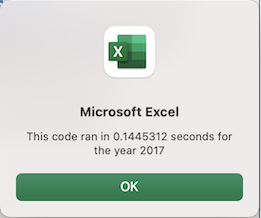

# Stock-Analysis

## Overview of Project

The Client Steve loved the workbook that we prepared for him. At the click of a button, he can analyze an entire dataset. Now, to do a little more research for his parents, he wants to expand the dataset to include the entire stock market over the last few years. Although your code works well for a dozen stocks, it might not work as well for thousands of stocks. And if it does, it may take a long time to execute. So, taking all this into consideration & further determining whether refactoring the code successfully makes the VBA script run faster.

### Purpose
The purpose of this project is to determine whether refactoring the code written to analyze stocks for Steve, successfully makes the VBA script run faster. 

## Results
On taking a look at the original code, the need for refactoring was confirmed. So, refactoring the code successfully made the VBA script ran faster here are the screenshot for both the years than the original VBA script.   

Original VBA script runtime

Refactored VBA script

 
  

And also the outputs of stock-analysis were calculated & available on a new worksheet called All Stock Analysis. Here are the screenshots showing the output for stock-analysis for the year 2017 & 2018.   

 
 
 

The output is presented in a table form with 3 columns named as Ticker, Total Daily Volume & Return. Here are the steps followed to get the output for the stock-analysis:

**Step 1a:**

Create a tickerIndex variable and set it equal to zero before iterating over all the rows. This tickerIndex is used to access the correct index across the four different arrays we'll be using: the tickers array and the three output arrays are created in Step 1b.

**Step 1b:**

Create three output arrays: tickerVolumes, tickerStartingPrices, and tickerEndingPrices.
The tickerVolumes array should be a Long data type.
The tickerStartingPrices and tickerEndingPrices arrays should be a Single data type.

**Step 2a:**

Create a for loop to initialize the tickerVolumes to zero.

**Step 2b:**

Create a for loop that will loop over all the rows in the spreadsheet.

**Step 3a:**

Inside the for loop in Step 2b, wrote a script that increases the current tickerVolumes (stock ticker volume) variable and adds the ticker volume for the current stock ticker. Use the tickerIndex variable as the index.

**Step 3b:**

Wrote an if-then statement to check if the current row is the first row with the selected tickerIndex. If it is, then assign the current starting price to the tickerStartingPrices variable.

**Step 3c:**

Wrote an if-then statement to check if the current row is the last row with the selected tickerIndex. If it is, then assign the current closing price to the tickerEndingPrices variable.

**Step 3d:**

Wrote a script that increases the tickerIndex if the next row’s ticker doesn’t match the previous row’s ticker.

**Step 4:**

Used a for loop to loop through the arrays (tickers, tickerVolumes, tickerStartingPrices, and tickerEndingPrices) to output the “Ticker,” “Total Daily Volume,” and “Return” columns in your spreadsheet.

Finally, we ran the stock analysis & checked whether refactoring the code successfully made the VBA script run faster & it did. So, the main purpose of the project & the output for Stock-analysis were met.

## Summary
- Every piece of code is written from a perspective of the developer. So, based on the perspective of a different developer there can be advantage & disadvantages of refactoring a code. The purpose of refactoring a code is to make it run faster, making the code easier to understand & easier to maintain. There are other benefits of refactoring, it changes the way a developer thinks about the implementation when not refactoring. There's also disadvantages when it comes to refactoring a code like it can be time consuming, no idea to how much time it will take to finish the entire process & sometimes it may land the developer in situation where the developer has no idea what to do next.

- The original VBA script advantage is that it works correctly. The advantages on the refactored VBA script is the refactored VBA script ran faster, thank the original VBA script here are the screenshots showing the runtime for the years 2017 & 2018 for refactored VBA script & original VBA script.

Original VBA script runtime

Refactored VBA script runtime

 

And the other advanatges of refactored VBA script was it's easier to understand & to maintain. The disadvantages of original VBA script was that the code was written in way that it read the excel sheet for one time for every ticker whereas the disadvantages of refactored VBA script is it was time consuming, no idea to how much time it would take to finish the entire process.